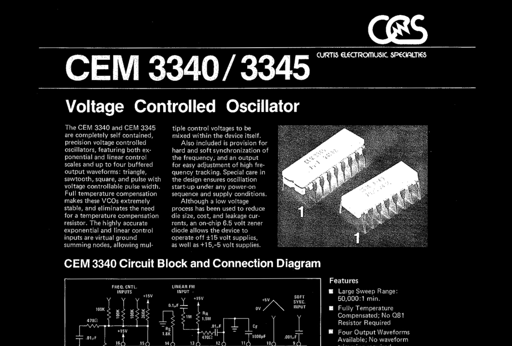

# 📖 PDF_OCR — Headings-Aware OCR PDF Annotator

Turn scanned or typewritten PDFs into searchable, annotated documents with intelligent heading detection — all in Python.

This project uses OCR (via Tesseract) to extract text from PDFs, detects likely headings, highlights them, and exports a new annotated PDF. It features a clean CLI built with Typer and includes rich progress output and shell autocompletion.

---

## 🚀 Features

- ✅ OCR with [Tesseract](https://github.com/tesseract-ocr/tesseract)
- 🧾 Heading detection (ALL CAPS + short text lines)
- 📄 Annotated and merged PDF output
- 🌀 Rich CLI with Typer and progress bars via Rich
- 🐚 Shell autocompletion (zsh/bash/fish supported)

---

## 📦 Setup

### 1. Prerequisites

Make sure you have the following installed:

- Python ≥ 3.11
- [Tesseract OCR](https://github.com/tesseract-ocr/tesseract) (`brew install tesseract` on macOS)
- [uv](https://github.com/astral-sh/uv) — fast Python package manager
- [direnv](https://direnv.net/) — autoenv loader for shell

### 2. Environment Setup

```bash
# Create a new Python virtual environment using uv
uv venv .venv

# Write this to .envrc for direnv to auto-activate your venv
echo 'source .venv/bin/activate' > .envrc
direnv allow
```

### 3. Install Dependencies

You can install everything with:

```bash
uv pip install pdf2image pytesseract reportlab PyPDF2 typer rich
```

Or if you're using a `requirements.txt`, do:

```bash
uv pip install -r requirements.txt
```

---

## ⚙️ Autocompletion (zsh)

To enable shell autocompletion:

```bash
eval "$(python main.py --install-completion zsh)"
```

For persistence, add that line to your `~/.zshrc`.

---

## 🧪 Usage

Once set up, run the script with:

```bash
python main.py run /path/to/your/file.pdf
```

What it does:

1. Converts each PDF page into an image.
2. Runs OCR on each page with `pytesseract`.
3. Detects headings based on heuristics (e.g., all caps short text).
4. Annotates the image (red for headings, black for body text).
5. Merges everything back into a single PDF.

📄 Output: `annotated_output.pdf` in the current directory.

---

## 🗂️ Project Structure

```
PDF_OCR/
├── main.py            # Entry point
├── cli.py             # Typer CLI logic
├── ocr_processor.py   # OCR + annotation logic
├── .envrc             # Direnv activation
├── README.md          # You are here
└── annotated_output.pdf  # Output after running the script
```

---

## 📸 Example



---

## 🔧 TODO

- [ ] Smarter heading classification (maybe ML-based)
- [ ] checkout spaCy for ocr_processing
- [ ] Optional output to .txt or .json
- [ ] Support for multi-column PDF layouts
- [ ] GUI wrapper?

---

## 🧑‍💻 Author

Built by **Marvin Hauke** — with ❤️, `typer`, `rich`, and `pytesseract`.

---

## 📄 License

MIT License — free to use, modify, and distribute.
