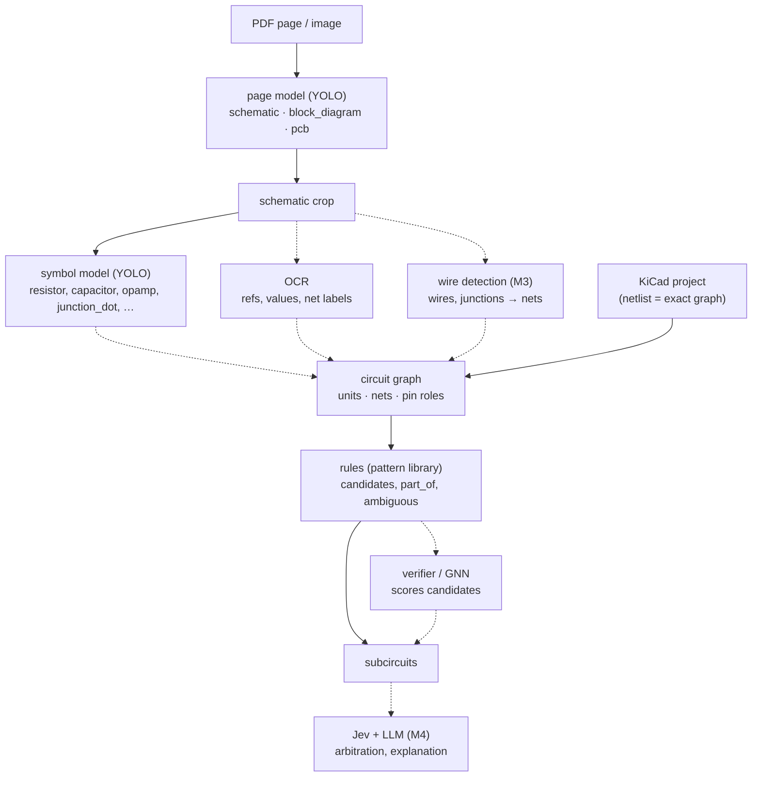
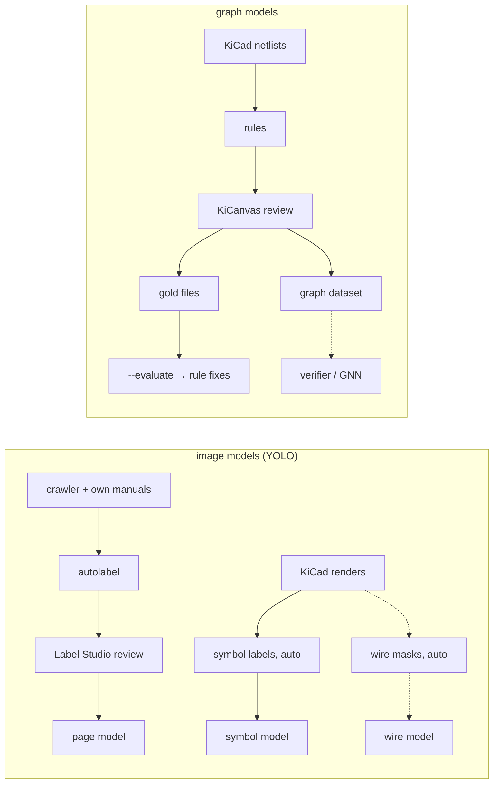

# Roadmap

Consolidated from the TODOs already scattered across the root `README.md` and
`training_project/`, organized by horizon. This isn't a commitment — it's a planning
surface to revisit and reprioritize.

## Current focus

Grow and clean the training data, then tune training. The pipeline (`pdf-ocr analyse`,
crawler, Label Studio loop) is in place; model quality is limited by the small dataset.
Next steps are listed at the top of the backlog in `experiments.md`.
Training runs, metrics and experiment ideas are tracked in
[`training_project/experiments.md`](../training_project/experiments.md), not here.

## Near-term (unblock the core pipeline)

- [x] **Dependency cleanup (2026-09-23):** dropped `pypdf2` for `pypdf`, dropped `pymupdf`
      and `opencv-contrib-python` (both unused directly, and the latter conflicted with
      transitive `opencv-python`). See git log for the full detail of what broke and how it
      was fixed.
  - **RF-DETR evaluated and deferred (2026-09-23):** investigated as an Apache-2.0 alternative
    to `ultralytics` YOLO11 (AGPL-3.0). Dataset compatibility is fine (RF-DETR auto-detects
    this project's existing YOLO-format `training_data/`, no conversion needed), but **Apple
    Silicon/MPS support is not solid** — an open upstream GitHub issue reports MPS training
    making a Mac unresponsive followed by a CoreML crash on retry, with no official fix at
    time of writing; a required op silently falls back to CPU even when it doesn't crash.
    Decision: stay on YOLO (already fast and working via MPS on this Mac) and revisit RF-DETR
    once upstream Apple Silicon support matures, rather than risk training stability now.
  - `docling` (MIT) has no strong reason to switch away from; `marker` is a faster
    Surya-OCR-based alternative worth knowing about if conversion speed becomes a bottleneck.
- [x] Reconcile the in-progress, uncommitted changes in `training_project/scripts/` — migrated
      from custom bash/zsh completion scripts to standard `argcomplete` global registration.
- [x] **PDF → YOLO pipeline (2026-09-23):** `src/pdf_ocr/` package. `pdf-ocr analyse` takes
      a PDF, an image, or a folder (default `input/`) and writes `output/<name>/` with
      rendered pages, annotated pages and `detections.json` (boxes in px and PDF points).
- [x] **Labeling loop closed (2026-09-23):** `pdf-ocr ingest` (`training_data/sources/` →
      `unlabeled/`, deduplicated by hash). `autolabel.py` now routes whole images (no more
      partially labeled training images), sends no-detection pages to review so misses get
      labeled, and moves files so reruns can't duplicate. `import_reviewed.py` brings Label
      Studio JSON exports back into `train/`/`val/`; `val/` only gets human-reviewed images.
      Workflow documented in `training_project/README.md`.
- [x] **Class name typo fixed (2026-09-23):** `schemtaic` → `schematic` in `data.yaml` and in
      the `best.pt`/`last.pt` weights via `scripts/rename_class.py` (no retraining needed:
      label files store only class ids).
- [x] **Label Studio environment (2026-09-23):** `scripts/start_label_studio.sh`,
      `scripts/setup_label_studio.py` (projects, Local Files storage, backend, deduplicated
      task import via the API) and `labelstudio/ml_backend.py` (own implementation of the ML
      backend protocol, since `label-studio-ml` needs `opencv-python-headless`). Two projects:
      schematics on pages, subcircuits on crops.
- [x] **Subcircuit stage started (2026-09-23):** `config/subcircuits.yaml` (`power_supply`,
      `amplifier`, `filter`, `oscillator`), `scripts/make_crops.py` (156 crops from the
      labeled pages). First round is manual, since there's no subcircuit model yet.
- [x] **Validation split fixed (2026-09-23):** val images were duplicates of train images.
      Inference uses `best.pt` (`use_best_weights: true`). Details in `experiments.md`.
- [ ] Plug the subcircuit model into `pdf-ocr analyse`: crop detected schematics and add
      subcircuits to `detections.json` (in page and PDF coordinates).
- [x] **Crawler (2026-09-23):** `pdf-ocr crawl wikimedia|kicad_github|archive_org|urls`, with
      free/restricted license tiers, reviewed/blocked host lists, robots.txt + TDM opt-out checks,
      a 1 GB total cap and provenance per file (`training_project/config/crawl.yaml`).
      `pdf-ocr ingest` gained `--dataset subcircuits` and `--max-pages`.
- [x] **Page classes `block_diagram` and `pcb` (2026-09-24)** next to `schematic`: labeling
      rules in the Label Studio view, `make_crops.py` crops only schematics, crawler source
      `wikimedia_blocks`, and `review_existing.py` + in-place relabeling in
      `import_reviewed.py` to re-check images already in `train/`/`val/`. None of the 145
      labeled boxes was a block diagram or PCB; 8 images with unlabeled candidates (e.g. a
      chorus block diagram in `val/`) are queued for review.
- [x] **Subcircuit classes extended (2026-09-24):** 4 functional blocks plus 9 building blocks
      (`current_mirror`, `voltage_divider`, `differential_pair`, `emitter_follower`,
      `comparator`, `rectifier`, `inverting_amp`, `non_inverting_amp`, `linear_regulator`),
      nested boxes allowed. Crawler hints for Commons *Voltage dividers* and *Comparators*.
- [ ] **Switch inference to a 3-class model** once one beats the single-class `run2` on
      `schematic` (runs in `experiments.md`).
- [ ] **Training tuning** (learning rate, augmentations, model size, image size): see the
      backlog in `experiments.md`. Image size stays 640 px for now.
- [ ] More service-manual sources: hobby sites (Lojinx, synfo.nl, servicemanual.altervista,
      SynthXL, Vintage Synth Parts), one at a time after checking each site's terms, then add
      the host to `reviewed_hosts`. elektronik-kompendium.de stays blocked unless the operator
      gives permission.
- [ ] Bring docling (`src/pdf_ocr/docling_convert.py`, still a standalone smoke test) into
      the pipeline, and extend `detections.json` into the intermediate-representation
      contract for the steps that follow (structure analysis, NLP enrichment).
- [ ] Wire in OCRmyPDF for scanned/annotated PDFs (already a dependency, not yet called
      from any pipeline code) — `ocrmypdf input.pdf output.pdf --deskew --clean --rotate-pages`.
- [ ] Implement `training_project/scripts/evaluate.py` (currently an empty stub) so trained
      models can be scored against the validation set without a one-off script.

## Mid-term (structure analysis + data generation)

- [ ] Analyse PDF structure with PyMuPDF/opencv2/YOLO (root README step 2) — layout regions,
      tables, figures — building on the existing trained YOLO model in `training_data/runs/run/`.
- [ ] Add NLP enrichment with Spacy/EasyOCR (root README step 3) — `spacy-layout` is already
      a dependency and pairs naturally with the docling output.
- [ ] Generate more training data automatically using docling for datasheet conversion
      (root README TODO).
- [ ] Evaluate ImageMagick for cropping images out of PDFs for training data (root README TODO).
- [ ] Scrape a KiCAD database/library for additional training data (root README TODO).
- [x] **Autolabeling image pipeline (scaffolded 2026-09-23)** — root README TODO, built as
      `training_project/src/{features,decisions,autolabeler}.py` +
      `scripts/autolabel.py`. Uses a threshold-stub decider until a real `TYPESAFE_API_KEY`
      is configured; see [`typesafe-integration.md`](./typesafe-integration.md#3-autolabeling-pre-filter-for-yolo-training-data--scaffolded)
      for the corrected design (Jev is text/JSON-only, arbitrates over extracted evidence, not
      the raw crop). Still needs: a real API key, and more source material (see the crawler item above).
      Flagged candidates route to a Label Studio pre-annotated task queue — run Label Studio
      via `uvx label-studio start` (isolated; installing it as a project dependency conflicts
      with the opencv version already required by easyocr/ultralytics, confirmed by testing).

## Circuit analysis (graph-based, decided 2026-09-24)

Subcircuits are **graph patterns, not shapes**: a voltage divider or current mirror is defined
by how parts are connected, and the same topology is drawn in many ways. So subcircuits are
found by pattern matching on a circuit graph, not by a YOLO subcircuit detector.

**Inference chain.** Solid = in place, dashed = missing. The KiCad path produces the same
graph as the image path, so everything after "circuit graph" is shared.

**Training loops.** Two independent loops that meet only at the graph format: the YOLO models
never see a graph, the graph model never sees pixels.

Graphs from images will be noisier than netlist graphs (a missed wire, a part detected as the
wrong type), so the graph model is trained on exact KiCad graphs with deliberate corruption
(dropped edges, swapped types) before it is used on graphs extracted from PDFs.

- [x] **M1 – pattern library on KiCad netlists** (`src/pdf_ocr/circuit/`, `pdf-ocr circuit`):
      netlist → graph → patterns (voltage divider, RC filters, decoupling, current mirror,
      differential pair, emitter follower, push-pull, op-amp stages, comparator, rectifier
      bridge, linear regulator, 555 astable/monostable), `part_of` for patterns inside
      stronger ones, `ambiguous` flags. Gold set + `--evaluate` for precision/recall.
- [~] **M2 – symbol detection:** training data generated from KiCad renders
      (`scripts/kicad_symbol_labels.py`), first model trained. Next: measure on real crops
      (scans, book photos), close the domain gap, more classes (jfet, transformer, crystal,
      switch, relay, connector), OCR for refs/values.
- [ ] **M3 – wire detection / connectivity** from images, the missing link between the YOLO models
      and the circuit graph. Ground truth comes free from KiCad projects (wires, junctions, labels,
      pins in `.kicad_sch`); classical extractor on clean renders first, measured against the true
      netlist, then scans and photos. Plan: [`wire_detection.md`](wire_detection.md).
- [ ] **M4 – Jev + LLM:** Jev arbitrates `ambiguous` matches with context (e.g. a
      differential pair with one grounded base in a VCF is an exponential converter), the LLM
      explains the structured result.
- [ ] **KiCanvas: review subcircuits in the browser** (MIT, local clone in
      `~/Development/javascript_typescript/kicanvas`, baseline builds and passes its 95 tests).
      Goal: replace the PNG `pdf-ocr circuit --review` with an interactive schematic.
      - Implement the documented but unused `zoom="<refs>"` embed attribute
        (`src/kicanvas/elements/kicanvas-embed.ts` declares it, nothing reads it): resolve refs
        with `schematic.find_symbol()`, union their `layers.query_item_bboxes()`, set
        `viewport.camera.bbox` like `zoom_to_selection()` does.
      - Multi-group highlight: today `paint_selected()` (`src/viewers/base/viewer.ts`) draws one
        box into the overlay layer; extend it to several labeled, colored groups, passed as
        child elements (`<kicanvas-highlight refs="R1 R2 U2.A" label="#1 voltage_divider">`, in
        the style of `<kicanvas-source>`). Multi-unit parts need ref + unit (`U2.A`).
      - Upstream: open an issue first (the project asks for coordination), then fork and PR,
        each step only after approval.
      - PDF_OCR side done: `pdf-ocr circuit --review` writes self-contained KiCanvas pages in the
        agreed "symbol groups" format (`src/pdf_ocr/circuit/review_html.py`); the KiCanvas side
        (panel, display) is developed in its own repo.
      - Review loop closed (2026-09-25): Correct/Wrong and new groups in KiCanvas, exported and
        imported with `--import-review` into gold files and a graph dataset
        (`training_data/circuits/graphs/`, `src/pdf_ocr/circuit/review_import.py`).
- Paused: YOLO subcircuit labeling (Label Studio project #5). A YOLO subcircuit model may come
  back later, trained on graph-derived boxes instead of manual labels.

## Long-term (schematic analysis + LLM hand-off)

- [ ] Analyse schematics for subcircuits (root README step 4): see "Circuit analysis" above.
- [ ] Feed an LLM with the generated context via MCP (root README step 5) — see
      [`typesafe-integration.md`](./typesafe-integration.md) for using cheap Jev judgments
      as a routing/gating layer in front of this step to cut down on LLM calls.
- [ ] Output additional information back to the electronic engineer to help build/repair PCBs
      (root README step 6).

## Process

- [ ] Turn this repo's TODOs into a GitHub Project (root README TODO) once the near-term
      items above settle.
